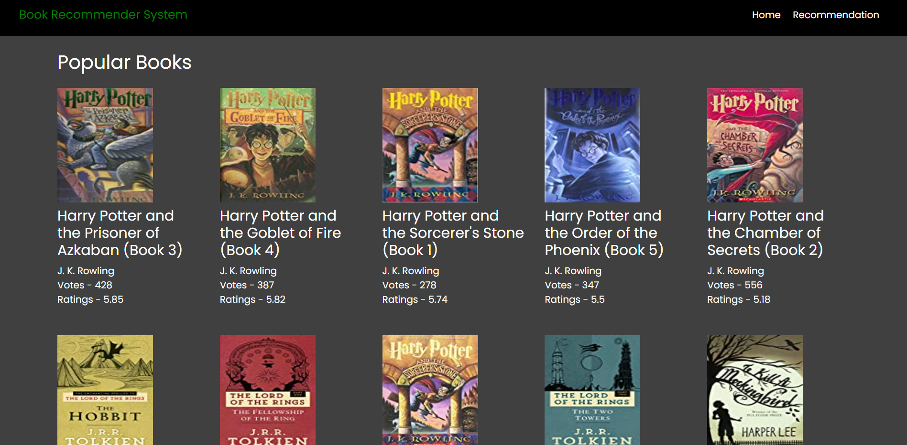
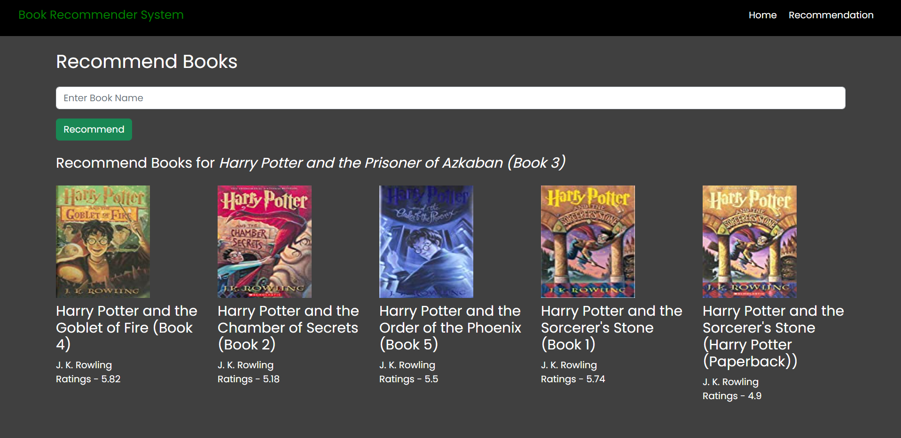

# Book Recommender System Using Flask
This is Book Recommender System made using Flask Framework that is used to recommend books. Created CI/CD Pipeline where used Docker for containerizing the flask web app and deployed it on Heroku platform.

## Website Link
Link: https://book-recommender-web-app.herokuapp.com/ 

## Popularity based Recommendation System
This recommendation system is used to show top 100 popular books. 
<table>
    <thead>
        <tr>
            <th>Home Page</th>
        </tr>
    </thead>
    <tbody>
        <tr>
            <td></td>
        </tr>
    </tbody>
</table>

## Collaborative-Filtering based Recommendation System
This recommendation system will show recommendation based on user ratings. 
<table>
    <thead>
        <tr>
            <th>Recommendation Page</th>
        </tr>
    </thead>
    <tbody>
        <tr>
            <td></td>
        </tr>
    </tbody>
</table>

## Dataset Link
Books Dataset - https://www.kaggle.com/datasets/saurabhbagchi/books-dataset

## Tools Used
- Python
- Flask
- Pandas
- Numpy
- Docker
- Heroku